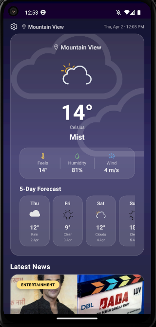
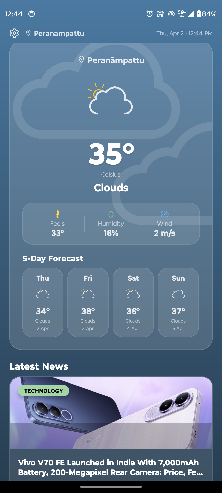
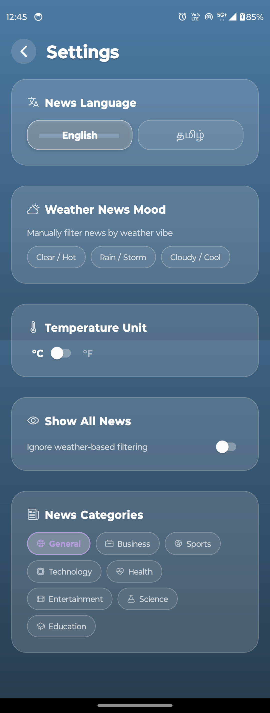

# 🌦 Atmos – News & Weather App

A React Native mobile application that provides real-time weather updates and latest news in one place with multi-language support.

---

## 🚀 Features

* 🌦 Live weather updates
* 📰 Latest news aggregation
* 🌐 Multi-language support (Tamil & English)
* ⚡ Smooth and responsive UI
* 📡 API-based dynamic data

---

## 🛠 Tech Stack

* React Native CLI
* JavaScript
* REST APIs
* AsyncStorage

---

## 📱 Screenshots

---
    
## 📦 Download APK

(Add link here later)

---

## 🤔 Why I built this

Built to provide users a single platform for both weather updates and news consumption, with support for regional language (Tamil).

---

## 🔮 Future Improvements

* Push notifications
* Offline support
* Expo migration (for OTA updates)

---

## 👨‍💻 Author

Abrar Ahmed
