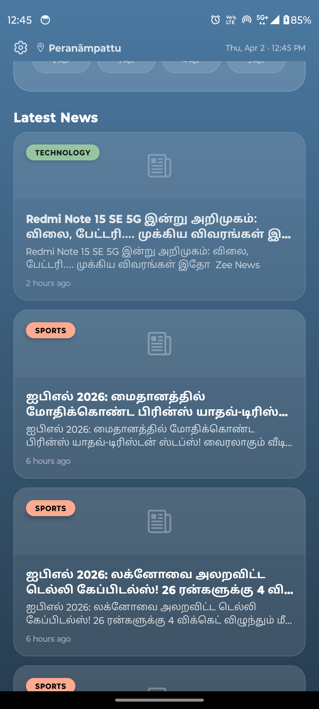

# 🌦 Atmos – News & Weather App

A modern React Native app that combines real-time weather updates and latest news into a single seamless experience, with support for regional languages like Tamil.

---

## 🚀 Features

* 🌦 Live weather updates
* 📰 Latest news aggregation
* 🌐 Multi-language support (Tamil & English)
* ⚡ Smooth and responsive UI
* 📡 API-based dynamic data

---

## ⭐ Key Highlights

* Built using React Native CLI with scalable architecture
* Integrated multiple APIs (weather + news)
* Supports regional language (Tamil)
* Designed for real-world usability and performance

---

## 🛠 Tech Stack

* React Native CLI
* JavaScript (ES6+)
* REST API Integration
* AsyncStorage (local storage)

---

## 📱 Screenshots

  
  

  
  

  
  

---

## 📦 Download APK

🚧 APK will be added soon

---

## 🧠 Architecture & Approach

* Modular component structure
* Separation of UI and business logic
* Reusable components for scalability

---

## 🤔 Why I built this

Built to provide users a single platform for both weather updates and news consumption, with support for regional language (Tamil).

---

## 🔮 Future Improvements

* Push notifications
* Offline support
* Expo migration (for OTA updates)

---

## 👨‍💻 Author

Abrar Ahmed
